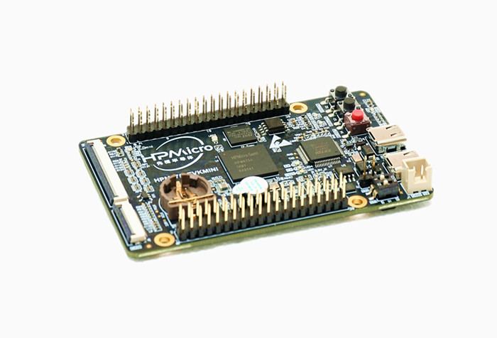

# Port TinyMaix to HPM6750EVKMINI

## Chip
|Item |Parameter|
|--   |--|
|Chip |HPM6750|
|Arch |RISC-V (Andes D45)|
|Freq |816M |
|Flash|8MB (External QSPI Flash)|
|RAM  |2MB SRAM + 32MB (External SDRAM)|
|Acceleration| RISC-V DSP Extension |

## Board
HPM6750EVKMINI:



## Development Environment
SEGGER Embedded Studio for RISC-V 6.40

With GCC 12.20 cc1/cc1plus/as


## Step/Project
Update macros in `tm_port.h` :

```c
#define TM_ARCH         TM_ARCH_CPU
#define TM_LOCAL_MATH   (1)         //use local math func (like exp()) to avoid libm
#define TM_GET_US()     (uint32_t)(HPM_MCHTMR->MTIME * 1000000uLL / clock_get_frequency(clock_mchtmr0))
```


Porting Project in:
https://github.com/xusiwei/TinyMaix_HPM6750


Benchmark project:
https://github.com/xusiwei/HPM6750_TinyMaix_Benchmark


Generate SEGGER Embedded Studio with:

```bash
generate_project -b hpm6750evkmini -t flash_xip -f
```


## Result

TM_MDL_INT8 (ms)

|Optimization Level  |mnist|cifar|vww96|mbnet128|Note|
|---     |---  |---  |---    |---     |---|
|None  |1.111    |90.570  |281.900    |515.106     ||
|Level 0  |1.111    |90.639  |281.902    |515.108     |*|
|Level 1 |0.526    |33.362  |119.447    |216.624     |*|
|Level 2 for speed | 0.461 |29.313   |105.515    |191.370     |*|

* in SEGGER Embedded Studio,  you can change optimization config in menu `Project 'xxx' Options -> Code -> Code Generation -> Optimization Level`


## Note

* In SEGGER Embedded Studio,  the default heap size is `16384` bytes, it's not enough to run vww96 and mbnet128 model.

* You can change heap size config in menu `Code -> Runtime Memory Area -> Heap Size`, likes `262144`.


## Author

[Siwei Xu](https://github.com/xusiwei)


